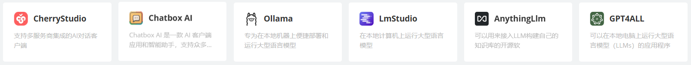

# AI 对话客户端

以下是几款AI开发工具及应用的详细介绍，针对不同使用场景进行分类解析：

### 1. **Cherry Studio**

**作用**：AI增强型创意设计协作平台（假设定位）
**核心功能推测**：

- **多模态创作**：集成文本/图像/音视频生成工具链
- **团队协作空间**：实时多人编辑与版本控制
- **智能资产库**：AI驱动的设计素材检索与管理
- **自动化工作流**：基于自然语言指令的排版/渲染优化

**典型使用场景**：

​	**数字内容生产**

- 广告公司批量生成营销文案+配图组合
- 自媒体创作者快速产出图文/短视频内容

​	**产品原型设计**

- 通过对话式交互生成UI界面原型
- 自动将设计稿转换为前端代码框架

​	**跨领域协作**

- 设计师与工程师共享AI生成的3D模型资产
- 实时AI翻译支持多语言团队协同

### **2. Chatbox AI**

**作用**：跨平台AI客户端聚合工具
**核心功能**：

- 统一管理多个API密钥（OpenAI/Claude等）
- 支持Prompt模板化保存
- 对话历史云同步功能

**使用场景**：

- **多模型协作**：同时调用不同供应商的AI服务
- **内容创作**：通过模板化Prompt提升写作效率
- **团队协作**：共享优化后的对话模板

### **3. Ollama**

**作用**：本地化运行开源大语言模型的命令行工具
**核心功能**：

- 支持本地部署Llama 3、Mistral、Phi-3等主流开源模型
- 通过命令行直接调用模型生成内容
- 支持多模型同时加载与切换

**使用场景**：

- **开发者测试**：快速验证不同模型在本地环境的表现
- **学术研究**：无需GPU服务器即可运行大型语言模型
- **离线场景**：无网络环境下通过终端使用AI能力

### **4. LM Studio**

**作用**：本地大语言模型管理及交互式开发平台
**核心功能**：

- 内置模型市场（HuggingFace集成）
- 可视化参数调节（温度、top_p等）
- 支持OpenAI API兼容接口

**使用场景**：

- **原型开发**：快速构建基于本地模型的AI应用
- **模型对比**：并行测试不同模型的输出质量
- **教育领域**：直观展示LLM参数调整对输出的影响

### **5. AnythingLLM**

**作用**：企业级私有化LLM应用构建平台
**核心功能**：

- 支持本地/云端多模态数据接入
- 提供白标企业级UI界面
- 内置RAG（检索增强生成）系统

**使用场景**：

- **知识库构建**：创建企业专属智能问答系统
- **内部系统集成**：与CRM/ERP等业务系统对接
- **合规审计**：完整记录AI交互过程日志

### **6. GPT4All**

**作用**：开源轻量化语言模型生态系统
**核心功能**：

- 提供经过优化的7B以下参数模型
- 跨平台支持（Win/Mac/Linux/iOS/Android）
- 本地运行零数据上传

**使用场景**：

- **移动端集成**：在手机等设备运行AI功能

- **隐私敏感场景**：医疗/金融等行业的合规需求

- **硬件受限环境**：在低配电脑运行基础AI任务

  

**参考**

1. [智能Ai导航站](https://ai888.site/)

