# Cherry Studio+Ollama本地部署DeepSeek R1

还在忍受网页版大模型的卡顿？本地部署的高硬件门槛让你望而却步？现在，这些痛点都能轻松解决！本文将手把手教你如何通过**硅基流动平台**和**Cherry Studio**，**1分钟快速部署DeepSeek大模型**，实现高效、低成本的AI开发。无论你是新手还是资深开发者，这篇教程都能助你快速上手！

------

## 1.API满血本地部署

### 1.1 访问硅基流动

打开硅基流动官方网站：[硅基流动](https://cloud.siliconflow.cn/i/N0iG4QMt)。

### 1.2 注册账号

1. 输入手机号码，获取验证码，点击“注册”即可完成账号创建。

   

### 1.3 创建API密钥

1. 登录后，进入“账户管理”中的“API秘钥”页面。

2. 点击“新建API密钥”，随意填写描述，点击“新建”即可生成秘钥。

   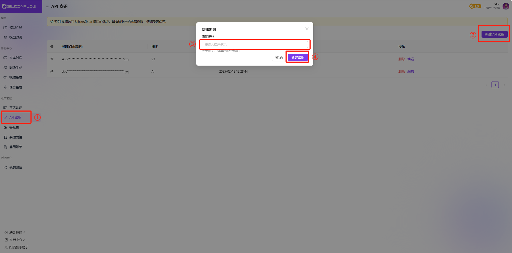

### 1.4 下载与安装Cherry Studio

访问Cherry Studio官方网站：[Cherry Studio](https://cherry-ai.com/)，下载并安装适合你系统的版本，安装过程只需“下一步”。

#### 1.4.1 配置API秘钥

1. 打开硅基流动网页，进入“API秘钥”页面，点击已创建的秘钥进行复制。

   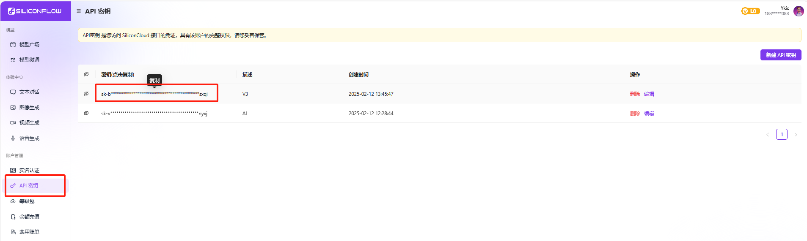

2. 打开Cherry Studio，进入“设置①”-“硅基流动②”，将复制的秘钥粘贴至“③”处。

   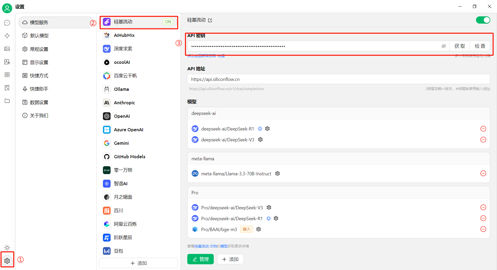

#### 1.4.2 加载DeepSeek模型

1. 打开硅基流动网页，进入“模型广场”，找到并点击“deepseek-ai/DeepSeek-V3”模型，复制模型名称。

   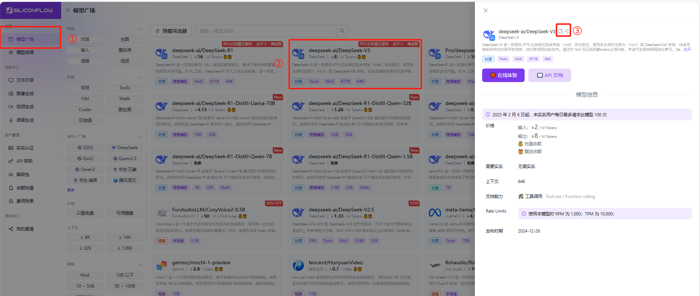

2. 在Cherry Studio中，进入“①设置”-“②硅基流动”，点击“③添加”，将复制的模型名称粘贴至“④”处，点击“⑤添加模型”。

   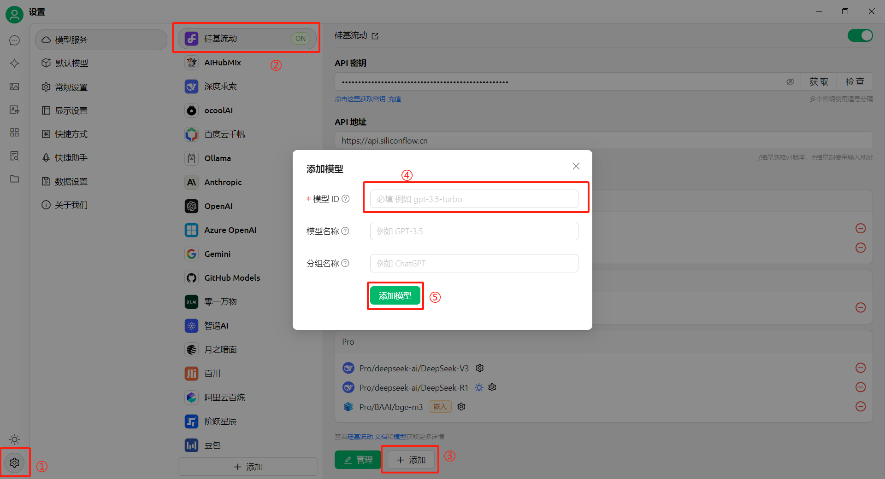

3. 点击“检查”，在下拉菜单中选择“deepseek-ai/DeepSeek-V3”，点击“确定”，出现“连接成功”字样即表示模型加载完成。

   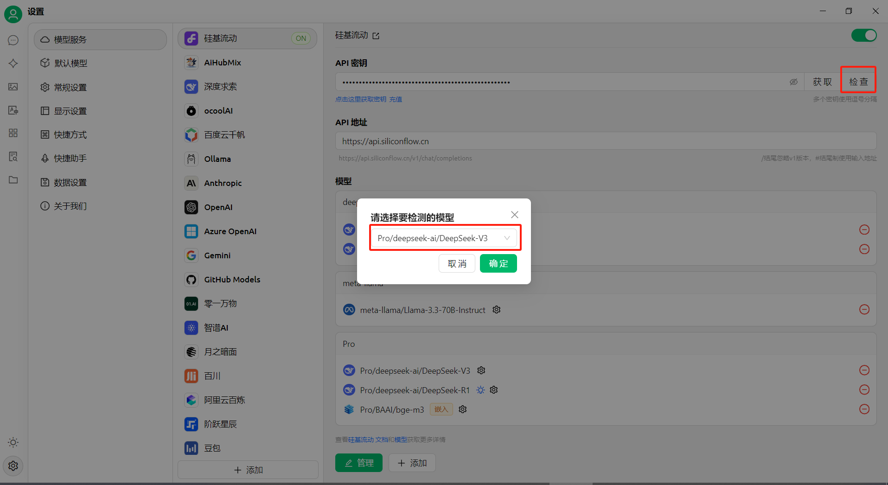

#### 1.4.3 运行与测试

1. 打开Cherry Studio，点击“①对话”，选择“②模型名称”，添加“③助手”以完成功能配置。

   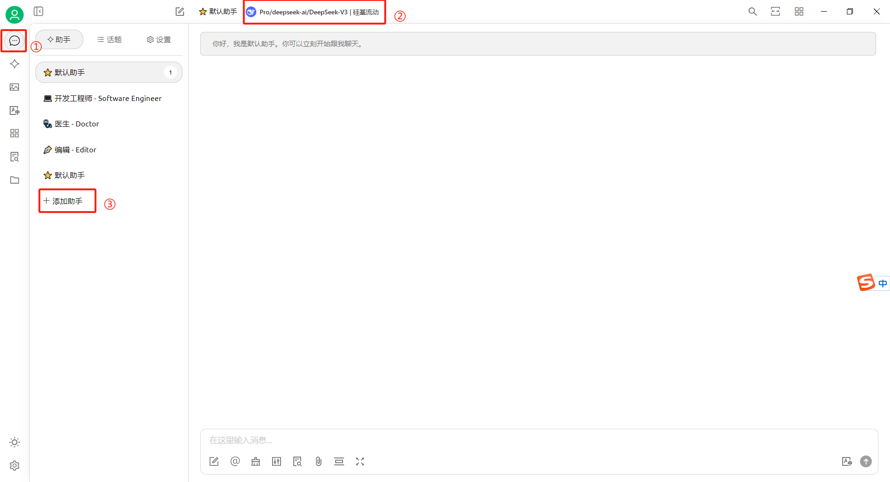

2. 完成上述步骤后，即可与DeepSeek进行对话。

   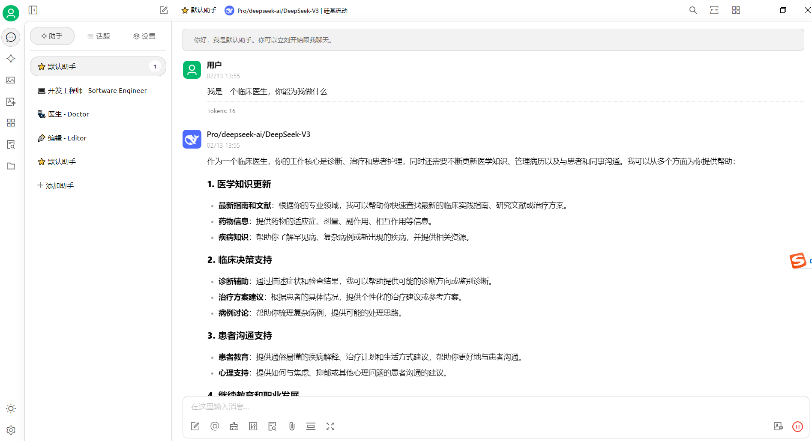

   

## 2.知识库

### 2.1创建知识库

点击左侧 知识库 → 添加，输入知识库名称（如“test”），选择嵌入模型 BAAI/bge-m3。

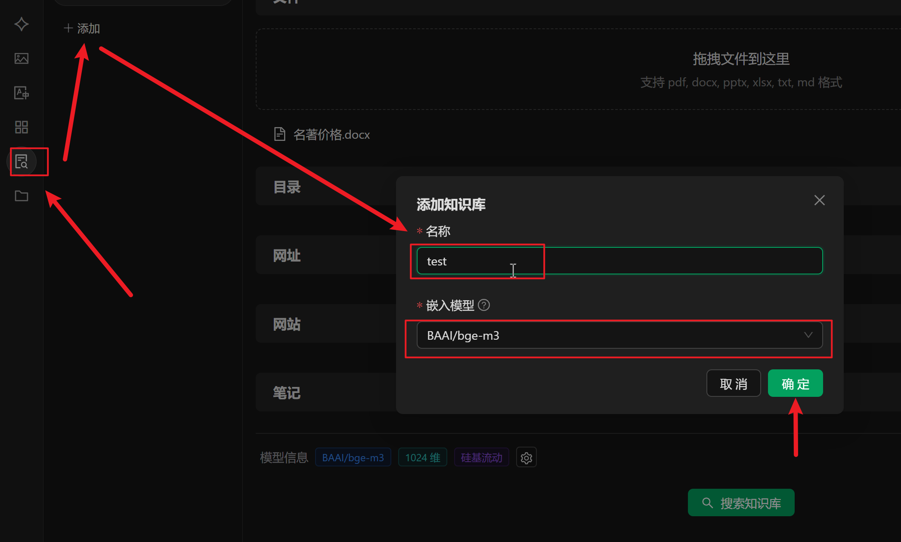

### 2.2上传文档并向量化

支持上传 PDF、Word、TXT、网页链接 等格式。拖拽文件至知识库界面，等待右侧出现绿色对勾即表示向量化完成。

注意：若文档含复杂表格或扫描件，需先用工具（如Doc2x）转换为结构化文本以提高解析精度。

**此处上传了一个虚构的名著价格知识库。**

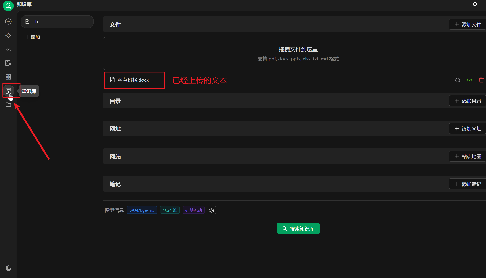

部分文本如下，可以自行使用以下文本创建文档并上传构建知识库测试：

### 2.3绑定知识库与模型

进入 聊天助手，选择 DeepSeek-R1 作为对话模型，点击下方 知识库图标 并勾选已创建的知识库（图标变蓝表示启用）。

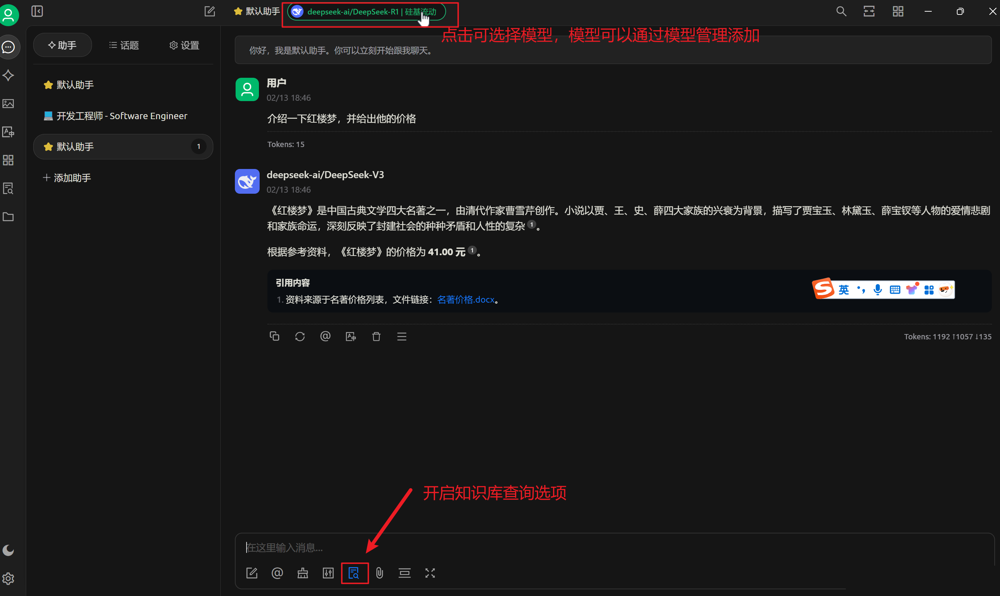

## 3.本地算力部署

### 3.1本地部署Ollama+DeepSeek

简单来说就是访问[Ollama的官网](https://ollama.com/download)，下载适配你的操作系统的客户端，安装好之后用`cmd`打开Windows系统自带的终端界面. 然后回到Ollama的官网，找到你想要下载的各种量级的模型对应的模型下载命令：

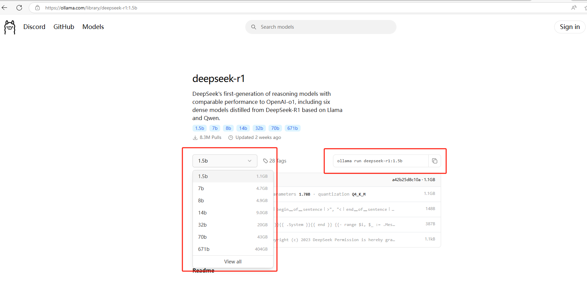

比如我这里下载1.5b的轻量级deepseek模型，就在cmd终端中执行这个命令就能安装了：

```c++
ollama run deepseek-r1:1.5b
```

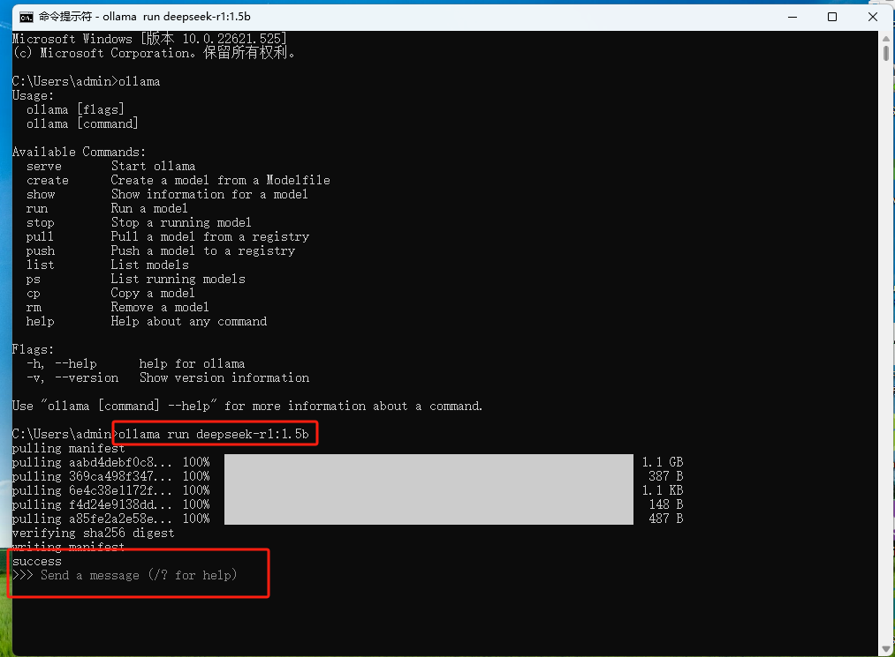

现在我们就已经能够在本地Windows电脑上通过ollama正常使用deepseek-r1模型与AI进行聊天了！

### 3.2**配置**

打开 Cherry Studio，在设置中找到 “模型设置” 选项。

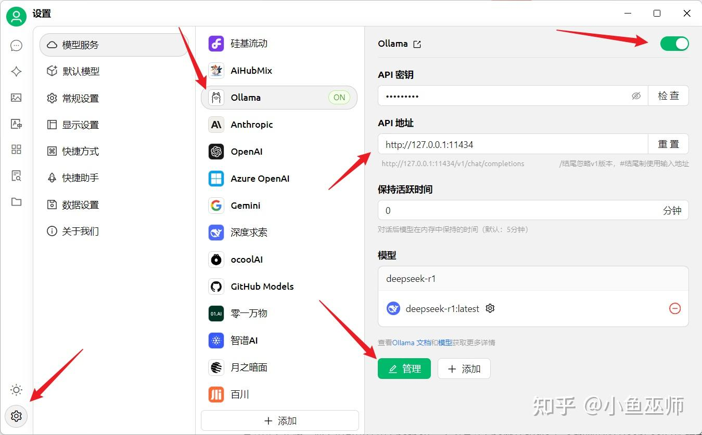

- **模型选择**：从模型列表中选择与你本地部署的 DeepSeek-R1 模型版本对应的选项，如果没有直接匹配项，选择支持自定义模型配置的入口。

- **自定义配置**：在自定义配置中，将 API 地址设置为http://localhost:11434 ，这是 Ollama 服务的默认接口地址，确保 Cherry Studio 能连接到本地运行的 DeepSeek-R1 模型。

- **模型参数设置**：根据你的硬件配置和使用需求，设置模型的相关参数，如最大生成长度、温度等，一般默认参数即可满足常见需求，但对于特定任务，你可以适当调整，比如生成创意文本时，可将温度调高至 0.8 - 1.0，以增加文本的多样性；进行严谨的知识问答时，可将温度调低至 0.5 - 0.7 ，使回答更稳定。

问题1: 你连接本地API地址，那么本地的API密钥是怎么来的? ollama默认密钥是ollama或者本地随便写就可以。
