# 本地部署Anything LLM+Ollama+DeepSeek R1

本文主要介绍如何在Windows电脑上本地安装Ollama并部署DeepSeek R1大模型，然后使用强大的开源AI工具Anything LLM结合cpolar内网穿透工具轻松实现随时随地使用与上传内容来训练本地部署的大模型，无需公网IP，也不用准备云服务器那么麻烦！

之前和大家分享过如何在Windows电脑上快速搭建DeepSeek R1大模型，并通过open webui实现在浏览器端远程访问与使用大模型，但是如果除了想要一个美观的聊天界面外还想要训练AI，让他更懂你所从事的专业问题的话，如果有一个可以将任何文档、资源（如网址链接、音频、视频）或内容片段转换为上下文，以便任何大语言模型（LLM）在聊天期间作为参考使用的软件就非常有必要了。

AnythingLLM就是这样一个全栈应用程序，您可以使用现成的商业大语言模型或流行的开源大语言模型，再结合向量数据库解决方案构建一个私有DeepSeek，不再受制于人：您可以本地运行，也可以远程托管，并能够与您提供的任何文档智能聊天。AnythingLLM将您的文档划分为称为`workspaces` (工作区)的对象，工作区的功能类似于线程，同时增加了文档的容器化。工作区可以共享文档，但工作区之间的内容不会互相干扰或污染，因此您可以保持每个工作区的上下文清晰。

Anything LLM支持多种部署方法，本例中我们将在Windows系统进行演示，下面就来详细进行介绍！

------

## 1. 本地部署Ollama+DeepSeek

简单来说就是访问[Ollama的官网](https://ollama.com/download)，下载适配你的操作系统的客户端，安装好之后用`cmd`打开Windows系统自带的终端界面. 然后回到Ollama的官网，找到你想要下载的各种量级的模型对应的模型下载命令：


比如我这里下载1.5b的轻量级deepseek模型，就在cmd终端中执行这个命令就能安装了：

```c++
ollama run deepseek-r1:1.5b
```


现在我们就已经能够在本地Windows电脑上通过ollama正常使用deepseek-r1模型与AI进行聊天了！

## 2. 本地安装Anything LLM

下面我们访问[Anything LLM的官网](https://anythingllm.com/desktop)下载Windows客户端：

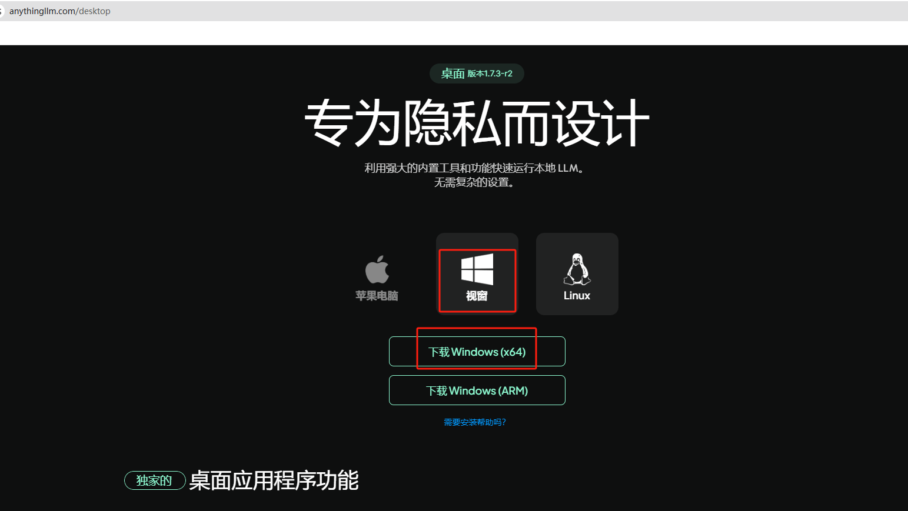

下载后，双击应用程序进行安装：

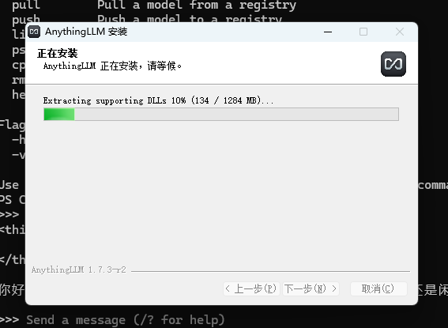

安装完毕后打开软件后，点击get started按钮进入使用界面：

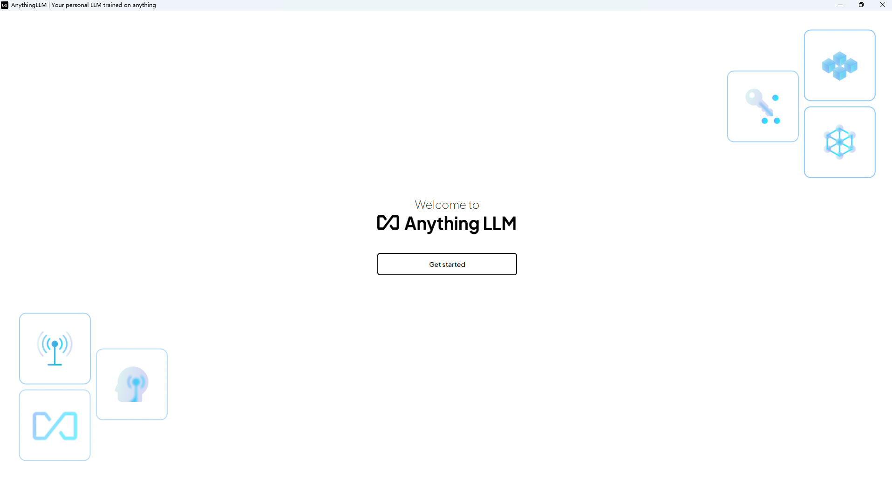


## 3. 配置与使用演示

第一步选择Ollama：

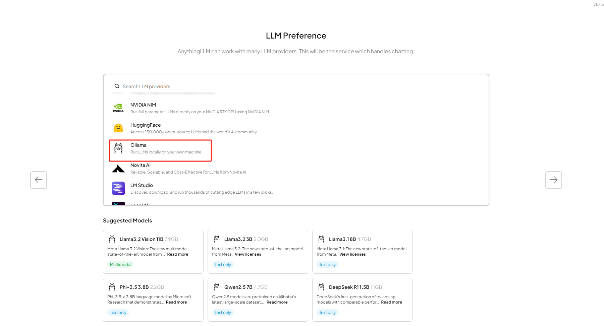

选择好之后，点击右侧的箭头，下方会出现选择使用哪个大模型的下拉框，我们可以在这里看到之前本地部署的deepseek-r1:1.5b模型，如果你本地还有其他模型，也会出现在这里。

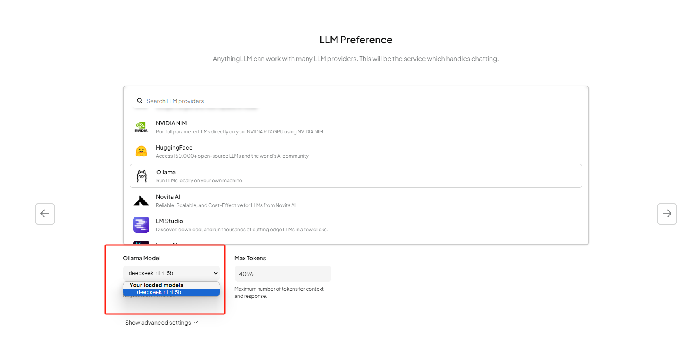

下一步确认信息后，点击右侧箭头继续：

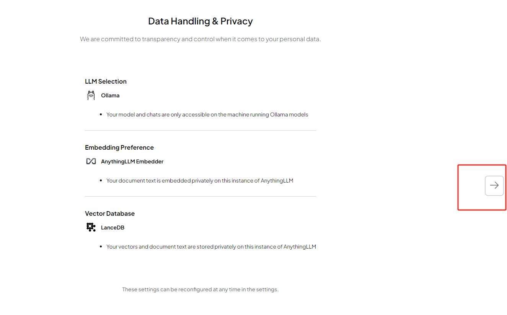

现在我们需要创建一个工作区，并给它取个名字，输入后继续点击右侧箭头：

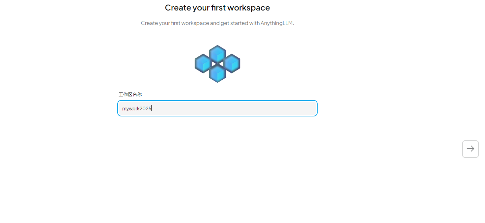

在Anything LLM中配置好了大模型，并创建了一个工作区后就可以看到欢迎界面了：

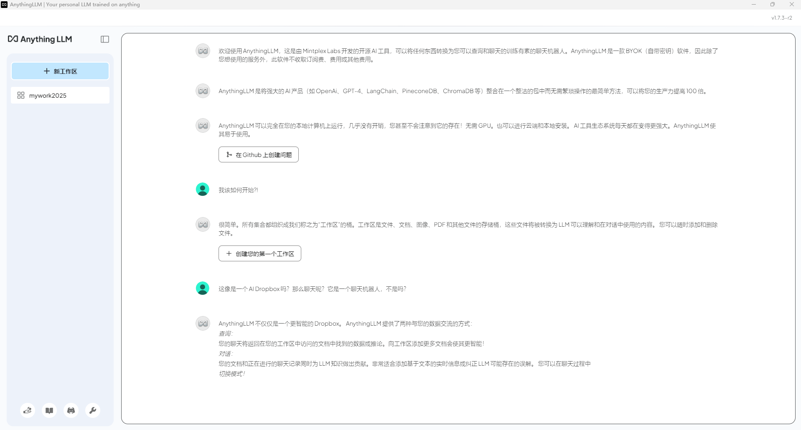

点击左下角的扳手（设置），我们可以对界面语言进行修改：

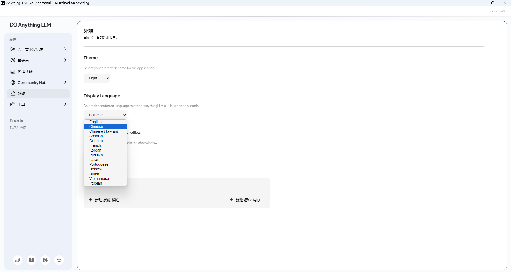

设置好之后，点击同一位置的返回按钮，即可回到工作区，在下方的输入框中，就可以和大模型聊天了！

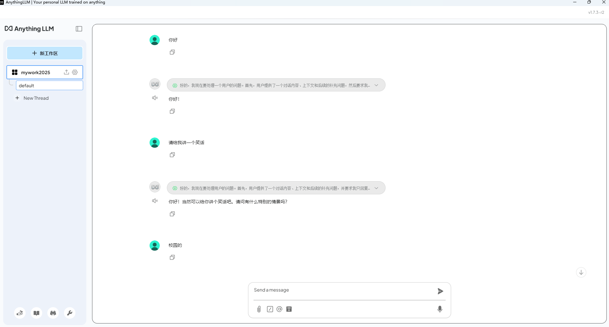

如果我们需要上传文件或是图片等资料，点击工作区名称标签后的上传按钮即可打开上传界面：

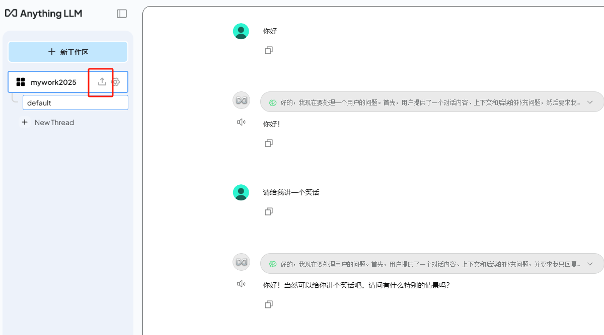

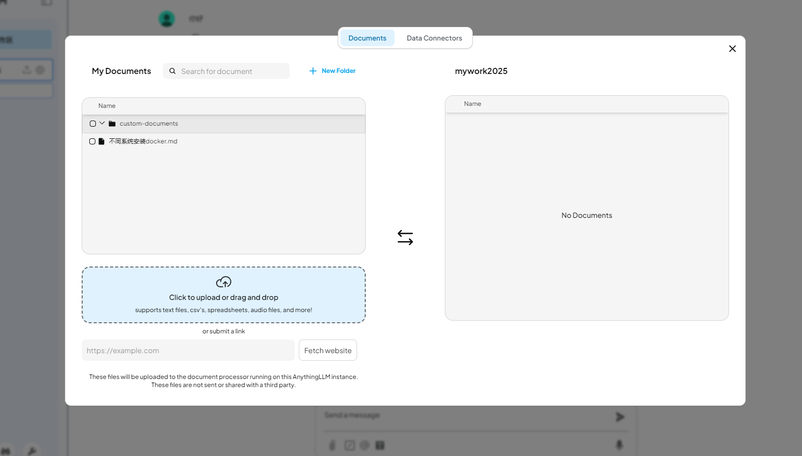

除了支持多种文档类型（PDF、TXT、DOCX等），在上传按钮下方还可以直接粘贴网址，真的是非常方便又全面。勾选你要上传的文件，

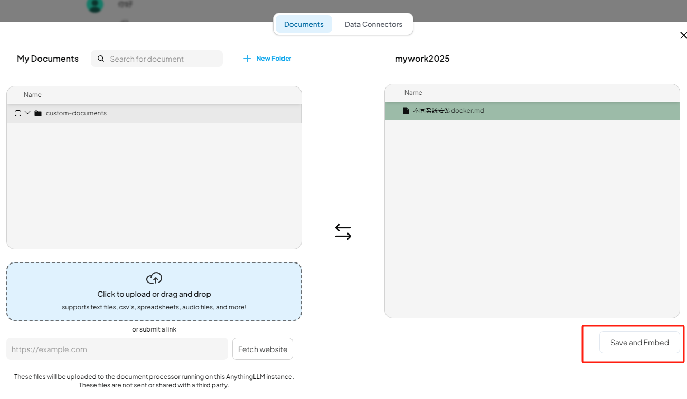

点击右下角的保存和嵌入按钮即可上传你的资料。通过Anything LLM管理超大文档时高效、低耗。只需要一次就可以嵌入（Embedding)一个庞大的文档或文字记录，比其他文档聊天机器人解决方案节省超多成本。


**参考：**

[本地部署Anything LLM+Ollama+DeepSeek R1打造智能知识库远程](https://www.cpolar.com/blog/local-deployment-of-anything-llmollamadeepseek-r1-to-create-intelligent-knowledge-base-and-remote-access)
