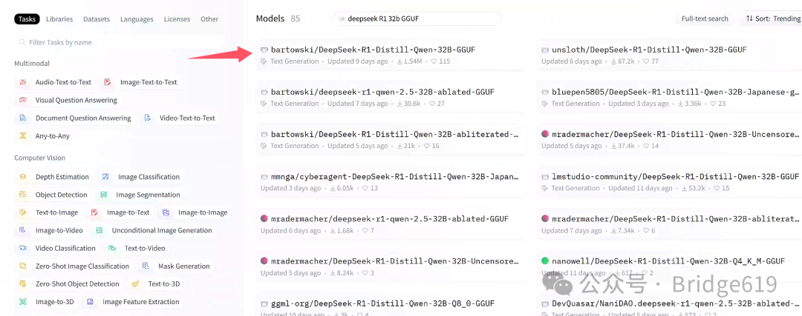
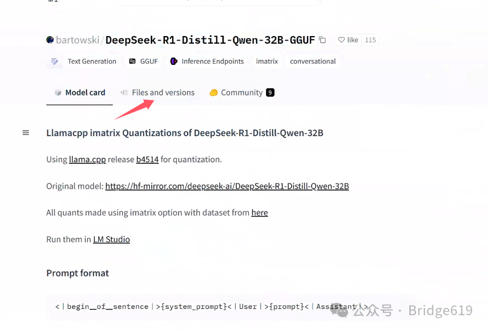
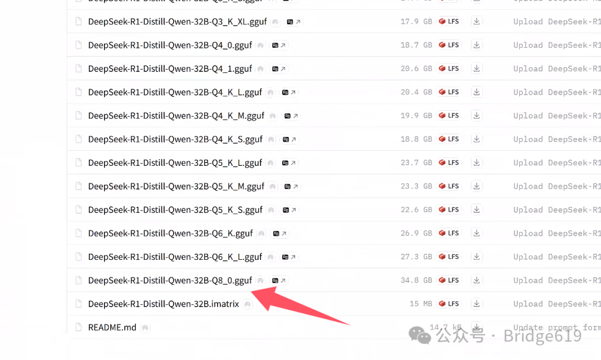
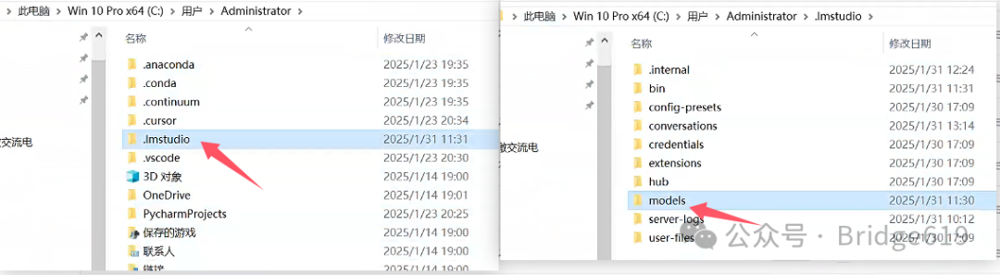
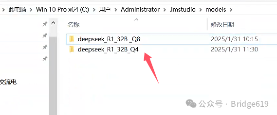
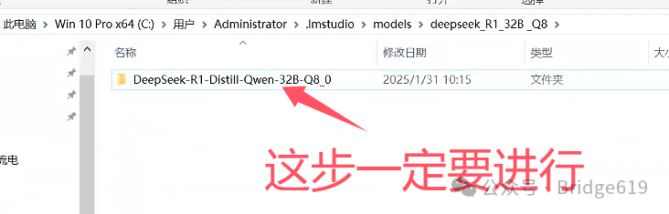
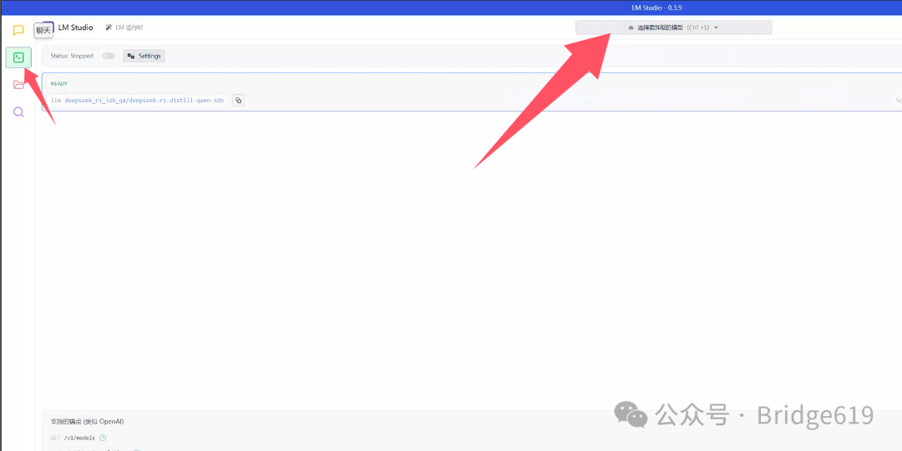
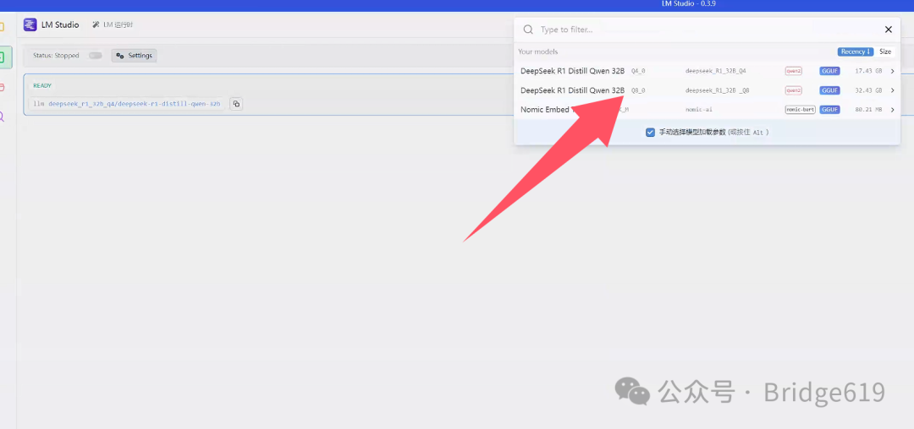
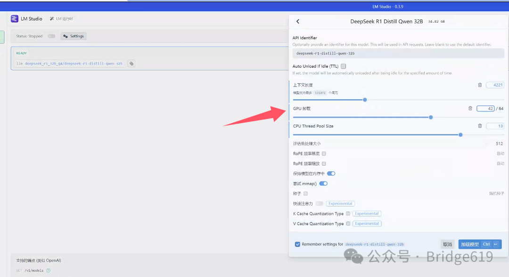

# LM Studio本地部署DeepSeek R1

## 1.DeepSeek 模型

DeepSeek凭借DeepSeek R1这两天在全网刷屏，去年12月末发布的DeepSeek V3 ，其实在科技圈就已经引起不少的震动，其通过优化算法和训练策略，大幅降低了训练成本，同时保持了高性能。其在自然语言处理任务中的表现尤为突出，能够更高效地完成文本生成、理解等复杂任务。

而近期刷屏的 DeepSeek R1，则是深度求索的最新力作。这款模型在推理速度上有了显著提升，支持 多轮对话、代码生成、长文本理解（最高 128K Token 上下文窗口），在数学推理和逻辑分析任务中表现尤为突出。R1的核心优势在于其更低的训练成本和更高的实用性，使其能够快速应用于实际场景中，满足不同行业的需求。

无论是 V3 还是 R1，深度求索都震惊了西方的大模型公司。再加上除夕夜发布的Janus pro多模态模型，一场全球信息平权和AI话语权的转移正在进行，2025年中国AI有更多的惊喜。

本文将以 DeepSeek R1 模型为例，结合 LM Studio 工具，记录从模型下载到本地部署的全流程。

电脑配置为：i9-14900K + RTX3090 24GB + 64G内存.

## 2.LM Studio 工具配置

本文使用 LM Studio来本地部署，LM Studio 是一款专为简化大语言模型本地化部署而设计的开源工具，由开发者社区积极维护迭代。

首先下载安装LM Studio, https://lmstudio.ai/

LM Studio官方说明是不会上传用户数据，但是它是一个闭源软件，所以为了确保我们的模型是本地运行，数据不会上传互联网，为LM Studio配置入站和出战规则，从windows防火墙层面隔绝LM Studio 与互联网的连接。

## 3.模型选择与获取

模型选择

没有GPU：1.5B Q8推理 或者 8B Q4推理

4G GPU：8B Q4推理

8G GPU：32B Q4推理 或者 8B Q4推理

16G GPU：32B Q4推理 或者 32B Q8推理

24G GPU: 32B Q8推理 或者 70B Q2推理

推荐使用 GGUF（兼容 CPU/GPU）或 GPTQ（GPU 专用）

GGUF：适用于 CPU 推理或低显存 GPU，支持逐层加载（部分权重驻留内存），灵活性高。

GPTQ：通过 4-bit 量化压缩模型，显存占用减少 60%，适合 RTX 3090/4090 等高性能 GPU。

这里使用32B Q8 GGUF格式。可在huggingface国内镜像站https://hf-mirror.com/下载，在官网搜索框内搜索deepseek R1 32b GGUF：

点击第一个也是下载量最多的那个：

点击Files and versions:

可以看到有一系列的32B模型，选择DeepSeek-R1-Distill-Qwen-32B-Q8_0.gguf下载：

模型共有三十多GB，有点大，静等完成下载即可.

## 4.本地模型加载

首先找到C盘用户Administrator文件夹下.lmstudio文件夹，然后找到models文件夹：

models文件夹这时有可能是空文件夹，没有关系，新建一个文件夹，比如我下载了32B Q8和Q4的模型，我就新建一个deepseek_R1_32B _Q8的文件夹和一个deepseek_R1_32B _Q4文件夹：

然后在deepseek_R1_32B _Q8文件夹中在新建一个文件夹，就以下载的模型文件名命名：DeepSeek-R1-Distill-Qwen-32B-Q8_0:

然后将下载好的文件模型文件DeepSeek-R1-Distill-Qwen-32B-Q8_0.gguf复制到该文件夹下即可。

## 5.模型测试

完成上述步骤后，运行LM Studio 软件，选择左侧开发者图标，点击选择要加载的模型，即可看到你所下载好的模型：

然后便可对一些参数进行调整：

**上下文长度（Context Length）**
定义：模型在处理文本时，一次能考虑的上下文长度。

作用：较长的上下文长度有助于模型更好地理解文本，但会增加计算负担和内存占用。

这里根据任务需求和自己的硬件性能调整，长文本任务可适当增加，短文本任务可减少以节省资源。一般设置为4000多。

**GPU负载（GPU Load）**
定义：GPU在模型推理或训练中的使用率。

作用：高负载表示GPU被充分利用，低负载则可能意味着计算资源未被有效使用。

这个根据自己的GPU显存大小调整若负载过低，可增加批量大小或并行任务；若负载过高，需减少任务或优化模型。可以在任务管理器中查看专用GPU内存占用进行调整，同时注意共享GPU内存不要占用过高.

**CPU线程池大小（CPU Thread Pool Size）**
定义：CPU用于并行处理任务的线程数量。

作用：更多线程可加速计算，但过多线程可能导致资源竞争和性能下降。

调整建议：根据CPU核心数和任务需求调整，通常设置为CPU核心数的1-2倍。

调整好参数后点击Remember seeting for和加载模型等待模型加载完成即可。

希望这篇教程能为您提供清晰的实践路径！

**参考:**

[LM Studio 本地部署DeepSeek 模型_lm studio deepseek-CSDN博客](https://blog.csdn.net/2401_82469710/article/details/145439957)
