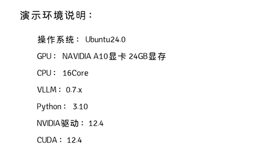
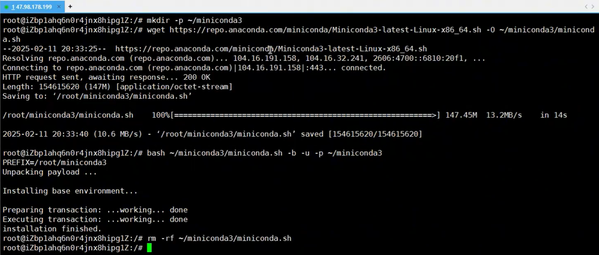

# 基于vLLM本地部署企业级DeepSeek-R1

## 1.vLLM

`vLLM`是伯克利大学[LMSYS](https://zhida.zhihu.com/search?content_id=238989790&content_type=Article&match_order=1&q=LMSYS&zhida_source=entity)组织开源的大语言模型高速推理框架，旨在极大地提升实时场景下的语言模型服务的吞吐与内存使用效率。`vLLM`是一个快速且易于使用的库，用于 LLM 推理和服务，可以和HuggingFace 无缝集成。vLLM利用了全新的注意力算法「PagedAttention」，有效地管理注意力键和值。

## 2.演示环境



### 2.1 环境设置

#### 2.1.1 install miniconda

[Installing Miniconda - Anaconda](https://www.anaconda.com/docs/getting-started/miniconda/install#macos-linux-installation)

```bash
wget https://repo.anaconda.com/miniconda/Miniconda3-latest-Linux-x86_64.sh -O ~/miniconda3/miniconda.sh
bash ~/miniconda3/miniconda.sh -b -u -p ~/miniconda3
```


