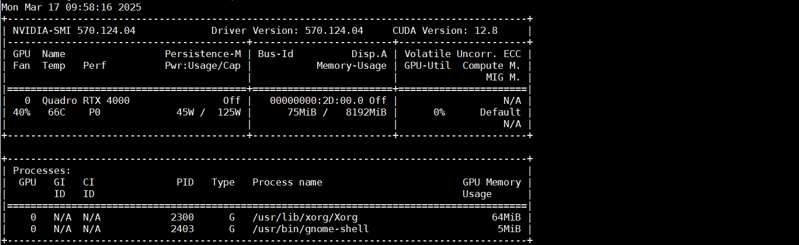
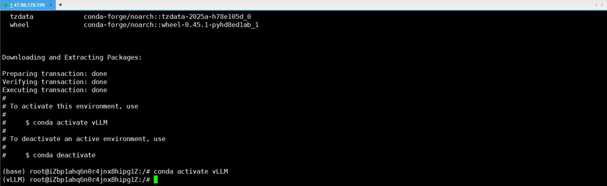
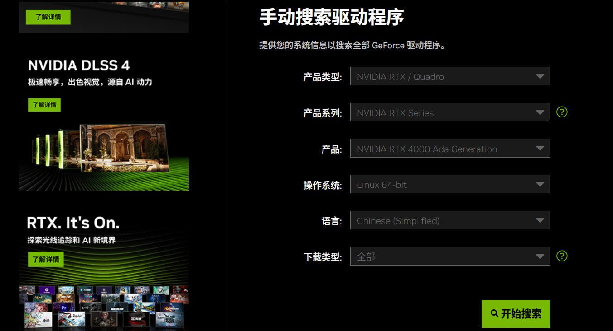
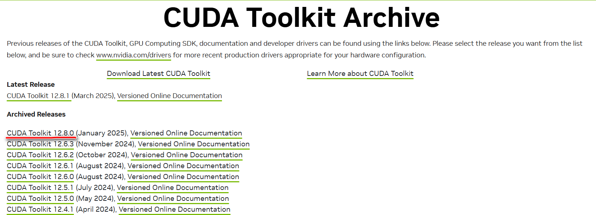
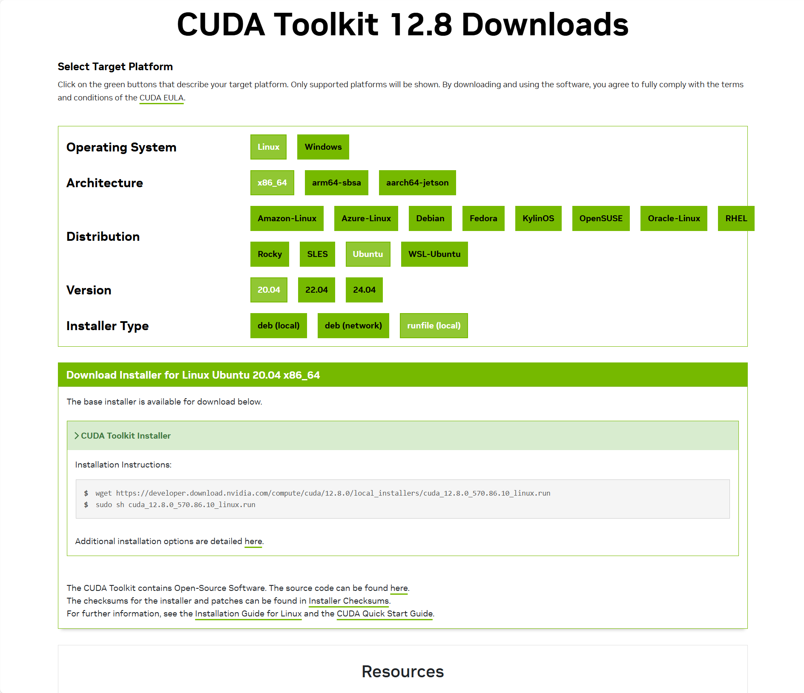
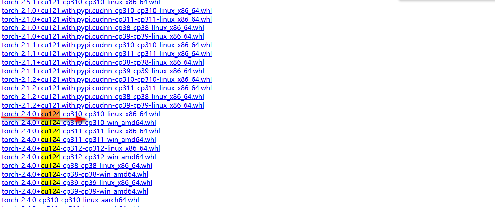
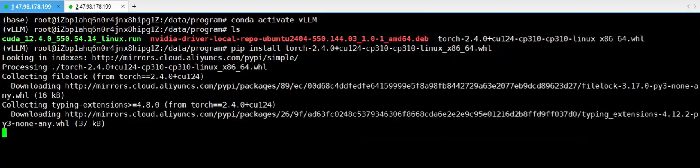
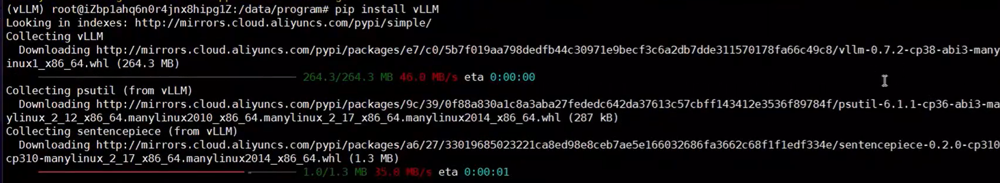
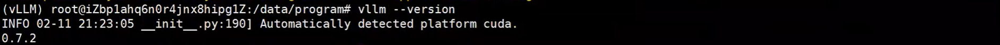
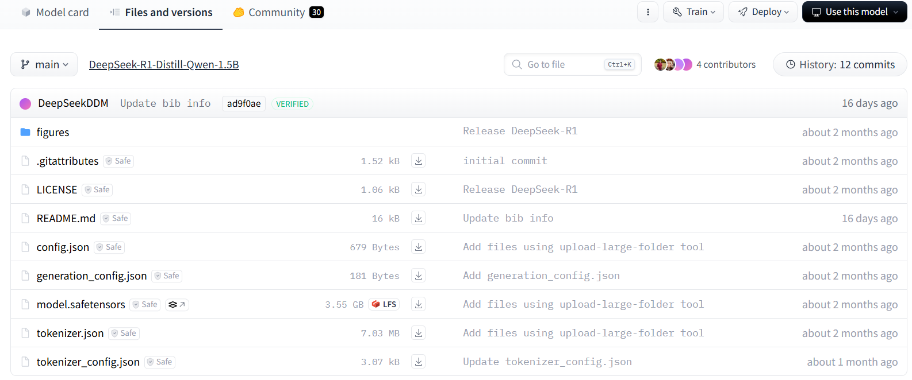

# 基于vLLM本地部署企业级DeepSeek-R1实战

## 1.vLLM

`vLLM`是伯克利大学[LMSYS](https://zhida.zhihu.com/search?content_id=238989790&content_type=Article&match_order=1&q=LMSYS&zhida_source=entity)组织开源的大语言模型高速推理框架，旨在极大地提升实时场景下的语言模型服务的吞吐与内存使用效率。`vLLM`是一个快速且易于使用的库，用于 LLM 推理和服务，可以和HuggingFace 无缝集成。vLLM利用了全新的注意力算法「PagedAttention」，有效地管理注意力键和值。

## 2.演示环境



### 2.1 环境设置

#### 2.1.1 install miniconda

[Installing Miniconda - Anaconda](https://www.anaconda.com/docs/getting-started/miniconda/install#macos-linux-installation)

```bash
mkdir ~/miniconda3
wget https://repo.anaconda.com/miniconda/Miniconda3-latest-Linux-x86_64.sh -O ~/miniconda3/miniconda.sh
bash ~/miniconda3/miniconda.sh -b -u -p ~/miniconda3
```


#### 2.1.1 激活miniconda

```bash
~/miniconda3/bin/conda init bash
source ~/.bashrc
```


#### 2.1.2 修改镜像源

```bash
vim ~/miniconda3/.condarc
```


```bash
show_channel_urls: true
channels:
  - https://mirrors.tuna.tsinghua.edu.cn/anaconda/cloud/pytorch
  - https://mirrors.tuna.tsinghua.edu.cn/anaconda/cloud/msys2
  - https://mirrors.tuna.tsinghua.edu.cn/anaconda/cloud/conda-forge
  - https://mirrors.tuna.tsinghua.edu.cn/anaconda/pkgs/main
  - https://mirrors.tuna.tsinghua.edu.cn/anaconda/pkgs/free
custom_channels:
  conda-forge: https://mirrors.tuna.tsinghua.edu.cn/anaconda/cloud
  msys2: https://mirrors.tuna.tsinghua.edu.cn/anaconda/cloud
  bioconda: https://mirrors.tuna.tsinghua.edu.cn/anaconda/cloud
  menpo: https://mirrors.tuna.tsinghua.edu.cn/anaconda/cloud
  pytorch: https://mirrors.tuna.tsinghua.edu.cn/anaconda/cloud
  pytorch-lts: https://mirrors.tuna.tsinghua.edu.cn/anaconda/cloud
  simpleitk: https://mirrors.tuna.tsinghua.edu.cn/anaconda/cloud
```

#### 2.1.3 创建conda虚拟环境

```bash
conda create --name vLLM python==3.10 -y
conda env list
conda activate vLLM
```



#### 2.1.4 安装驱动

```bash
conda activate vLLM
sudo apt update
sudo apt upgrade -y
sudo apt install -y build-essential dkms
sudo update-initramfs -u
```

[NVIDIA GeForce 驱动程序 - N 卡驱动 | NVIDIA](https://www.nvidia.cn/geforce/drivers/)



```bash
sudo sh NVIDIA-Linux-x86_64-570.124.04.run
apt install -y cuda-drivers
reboot
conda activate vLLM
nvcc --version ## check the cuda version
nvidia-smi
```


[CUDA Toolkit Archive | NVIDIA Developer](https://developer.nvidia.com/cuda-toolkit-archive)





```bash
wget https://developer.download.nvidia.com/compute/cuda/12.8.0/local_installers/cuda_12.8.0_570.86.10_linux.run
sudo sh cuda_12.8.0_570.86.10_linux.run
```

```
vim /root/.bashrc

export LD_LIBRARY_PATH=$LD_LIBRARY_PATH:/usr/local/cuda-12.4/lib64
export PATH=$PATH:/usr/local/cuda-12.4/bin
export CUDA_HOME=$CUDA_HOME:/usr/local/cuda-12.4

source /root/.bashrc

nvcc --version
```

[download.pytorch.org/whl/torch/](https://download.pytorch.org/whl/torch/)









### 2.2 部署模型

#### 2.2.1 下载模型方式1

[deepseek-ai/DeepSeek-R1-Distill-Qwen-1.5B at main](https://hf-mirror.com/deepseek-ai/DeepSeek-R1-Distill-Qwen-1.5B/tree/main)



#### 2.2.2 下载模型方式2

```bash
conda activate vLLM

pip install modelscope

modelscope download --model deepseek-ai/DeepSeek-R1-Distill-Qwen-1.5B --local_dir /data/models/deepseek-ai/DeepSeek-R1-Distill-Qwen-1.5B
```

#### 2.2.3 运行

```bash
conda activate vLLM

CUDA_VISIBLE_DEVICES=0 vllm serve /data/models/deepseek-ai/DeepSeek-R1-Distill-Qwen-1.5B --tensor-parallel-size 1 --max-model-len 32768 --enforce-eager
```


**参考：**

[【保姆级教程4】基于vLLM本地部署企业级DeepSee-R1，30分钟手把手教学，小白_码农皆宜！附 - 4_哔哩哔哩_bilibili](https://www.bilibili.com/video/BV1BUR3Y3Ejd/?spm_id_from=333.788.player.switch&vd_source=68a8583f88fde22ce39c9c2212b4cac4&p=5)
