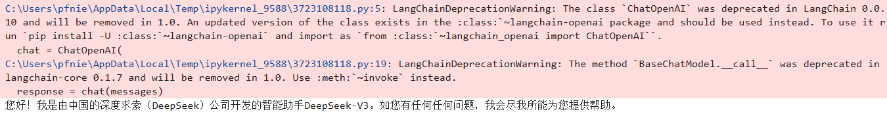

# AI Agent入门到精通


## 1. 环境安装

```python
安装Python3.10.2版本: 
https://mirrors.huaweicloud.com/python/3.10.2/
pip install --upgrade pip --user

安装jupyterlab
官网：https://jupyter.org/install
命令安装: pip install jupyterlab==4.3.5 -i https://pypi.mirrors.ustc.edu.cn --user
启动：jupyter-lab
```

## 2. 使用openai测试Deepseek

```python
安装openai
pip install openai==1.65.2 --user
```

```python
# Please install OpenAI SDK first: `pip install openai==1.65.2 --user`

from openai import OpenAI

client = OpenAI(api_key="<DeepSeek API Key>", base_url="https://api.deepseek.com")

response = client.chat.completions.create(
    model="deepseek-chat",
    messages=[
        {"role": "system", "content": "You are a helpful assistant"},
        {"role": "user", "content": "Hello"},
    ],
    stream=False
)

print(response.choices[0].message.content)
```

## 3. 使用langchain测试Deepseek

```python
pip install langchain==0.3.19
pip install langchain_community==0.3.18
pip install langchain-openai==0.3.7
```

### 3.1 例子1

```python
from langchain.chat_models import ChatOpenAI
from langchain.schema import HumanMessage, SystemMessage

# 1. 创建 ChatOpenAI 实例
chat = ChatOpenAI(
    model="deepseek-chat",
    openai_api_key="sk-bf9cb507120c42d49366e6aabd1f4157",
    openai_api_base="https://api.deepseek.com",
    streaming=False
)

# 2. 创建消息列表
messages = [
    SystemMessage(content="You are a helpful assistant"),
    HumanMessage(content="介绍一下你自己"),
]

# 3. 调用模型并获取响应
response = chat(messages)

# 4. 打印响应内容
print(response.content)
```



### 3.2 例子2

```python
from langchain_openai import ChatOpenAI
from langchain.schema import HumanMessage, SystemMessage

# 初始化 ChatOpenAI 实例
chat = ChatOpenAI(
    model="deepseek-chat",
    openai_api_key="sk-bf9cb507120c42d49366e6aabd1f4157",
    openai_api_base="https://api.deepseek.com",
    streaming=False
)

# 构建消息列表
messages = [
    SystemMessage(content="You are a helpful assistant"),
    HumanMessage(content="介绍一下你自己"),
]

# 调用模型并获取响应
response = chat.invoke(messages)

# 打印响应内容
print(response.content)
```

### 3.3 例子3

```python
from langchain_openai import ChatOpenAI
from langchain.schema import HumanMessage, SystemMessage

# 初始化 ChatOpenAI 实例
chat = ChatOpenAI(
    model="deepseek-r1:1.5b",
    openai_api_key="sk-bf9cb507120c42d49366e6aabd1f4157",
    openai_api_base="http://localhost:11434/v1",
    streaming=False
)

# 构建消息列表
messages = [
    SystemMessage(content="You are a helpful assistant"),
    HumanMessage(content="介绍一下你自己"),
]

# 调用模型并获取响应
response = chat.invoke(messages)

# 打印响应内容
print(response.content)
```

### 3.4 例子4

```python
from langchain_openai import ChatOpenAI
from langchain.prompts import PromptTemplate

# 初始化 ChatOpenAI 实例
chat = ChatOpenAI(
    model="deepseek-chat",
    openai_api_key="sk-bf9cb507120c42d49366e6aabd1f4157",
    openai_api_base="https://api.deepseek.com",
    streaming=False
)

prompt = PromptTemplate.from_template(template="你是一个{name}, 帮我起一个具有{country}特色的{sex}名字.")
messages = prompt.format(name="算命大师", country="法国", sex="女孩")

# 调用模型并获取响应
response = chat.invoke(messages)

# 打印响应内容
print(response.content)
```

### 3.5 例子5

```python
from langchain_openai import ChatOpenAI
from langchain.prompts import ChatPromptTemplate

# 初始化 ChatOpenAI 实例
chat = ChatOpenAI(
    model="deepseek-chat",
    openai_api_key="sk-bf9cb507120c42d49366e6aabd1f4157",
    openai_api_base="https://api.deepseek.com",
    streaming=False
)

chat_prompt = ChatPromptTemplate.from_messages(
    [
    ("system", "你是一个起名大师，你的名字叫{name}"),
    ("human", "你好{name}, 你感觉如何？"),
    ("ai", "你好，我状态非常好."),
    ("human", "{user_input}"),
    ]
)
messages = chat_prompt.format_messages(name="聂大师", user_input="你叫什么名字")

# 调用模型并获取响应
response = chat.invoke(messages)

# 打印响应内容
print(response.content)
```

### 3.6 例子6

```python
from langchain_openai import ChatOpenAI
from langchain.schema import HumanMessage, SystemMessage, AIMessage

# 初始化 ChatOpenAI 实例
chat = ChatOpenAI(
    model="deepseek-chat",
    openai_api_key="sk-bf9cb507120c42d49366e6aabd1f4157",
    openai_api_base="https://api.deepseek.com",
    streaming=False
)

# 构建消息列表
messages = [
    SystemMessage(content="你是一个起名大师，你的名字叫徐大师"),
    HumanMessage(content="你好徐大师, 你感觉如何？"),
    AIMessage(content="你好，我状态非常好."),
    HumanMessage(content="你叫什么名字"),
]

# 调用模型并获取响应
response = chat.invoke(messages)

# 打印响应内容
print(response.content)
```

### 3.7 例子7

```python
from langchain_openai import ChatOpenAI
from langchain.schema import HumanMessage, SystemMessage, AIMessage

# 初始化 ChatOpenAI 实例
chat = ChatOpenAI(
    model="deepseek-chat",
    openai_api_key="sk-bf9cb507120c42d49366e6aabd1f4157",
    openai_api_base="https://api.deepseek.com",
    streaming=False
)

# 定义变量
user_name = "徐大师"
ai_status = "非常好"

# 构建消息列表
messages = [
    SystemMessage(content=f"你是一个起名大师，你的名字叫{user_name}"),
    HumanMessage(content=f"你好{user_name}, 你感觉如何？"),
    AIMessage(content=f"你好，我状态{ai_status}."),
    HumanMessage(content="你叫什么名字"),
]

# 调用模型并获取响应
response = chat.invoke(messages)

# 打印响应内容
print(response.content)
```

### **使用 `langchain_community` 的通用接口**

如果 DeepSeek 的 API 符合通用接口（如 OpenAI 兼容的 API），你可以直接使用 `langchain_community` 中已有的工具（如 `OpenAI` 或 `ChatOpenAI`）进行集成。例如，如果 DeepSeek 提供了 OpenAI 兼容的 API，可以通过以下方式调用：

```c++
from langchain_community.chat_models import ChatOpenAI

# 假设 DeepSeek 的 API 兼容 OpenAI
deepseek_chat = ChatOpenAI(
    model="deepseek-chat",
    api_key="sk-bf9cb507120c42d49366e6aabd1f4157",
    base_url="https://api.deepseek.com"  # DeepSeek 的 API 地址
)
response = deepseek_chat.predict("Hello, world!")
print(response)
```

