# 各类大模型运行GPU配置推荐

## 1.GPU计算性能核⼼参数详细介绍

• CUDA Cores：CUDA核⼼，是 NVIDIA GPU 的基础计算单元，负责执⾏并⾏计算任务；  

• Tensor Cores：张量计算核⼼，是专⻔设计⽤于矩阵运算的硬件单元，核⼼任务是加速矩阵乘法，特别是⽤于深度学习的张量运算，其中20系显卡开始加⼊张量核⼼； 

 • GPU Memory：显存，决定了可以加载的模型⼤⼩、数据批量（Batch Size）以及中间激 活值存储，显存不⾜会限制任务规模，甚⾄导致程序崩溃； 

 • FLOPS：每秒浮点计算次数，是衡量 GPU 浮点运算性能的单位，代表GPU的理论性能；  

• NVLink&NVSwitch：显卡桥接技术，30系显卡取消了NVLink，替代⽅案是PCIE，⽬前 NVLink只⽤于企业级图形显卡；

## 2.PCIe、NVLink与NVSwitch  技术⽅案介绍介绍与对⽐

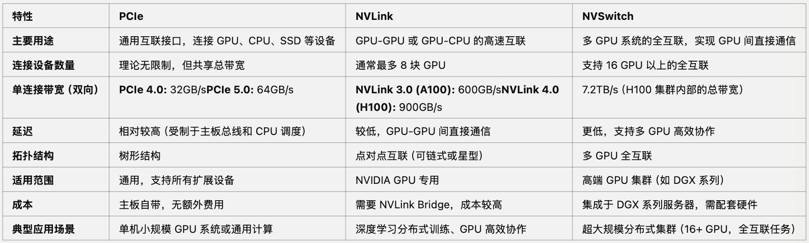

## 3.RTX显卡信息   NVIDIA Gaming Graphics Cards

3090 vs 4090显卡核⼼参数对⽐ 

• CUDA Cores：增加了56%  

• Tensor Cores：提升了4.6倍  

• 显存带宽：RTX 4090 带宽更⾼ （1,008 GB/s vs 936 GB/s）  

• RTX 4090 的第四代 Tensor  Core 引⼊ FP8 ⽀持，更适合低 精度推理任务。

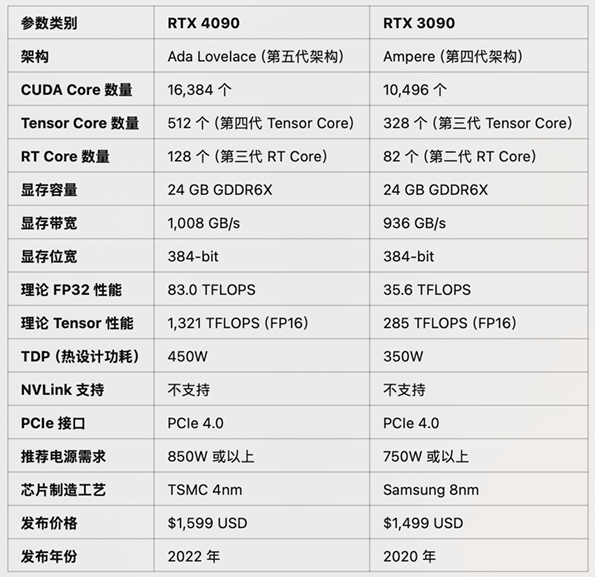

## 4.A100 PCIe&SXM、A800  显卡参数对⽐

• A800是A100的“中国特供 版”，在显存带宽和NVLink带 宽上有所限制； 

 • 其他参数都⼀样，两类卡性能 差异不超过20%。

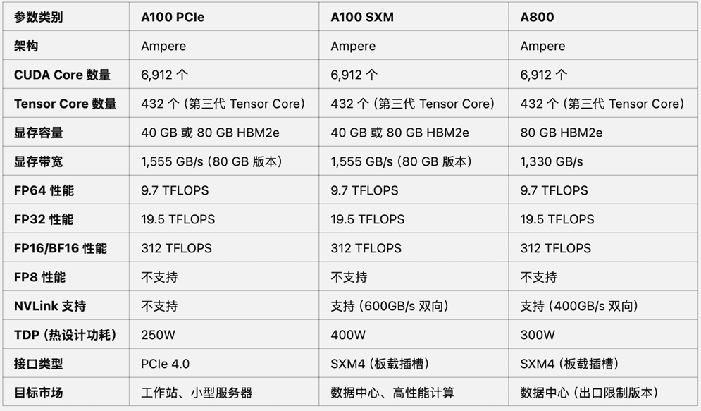

## 5.认识⽬前主流显卡，NVIDIA主流显卡命名规则

### 5.1NVIDIA显卡主要分类及命名规则

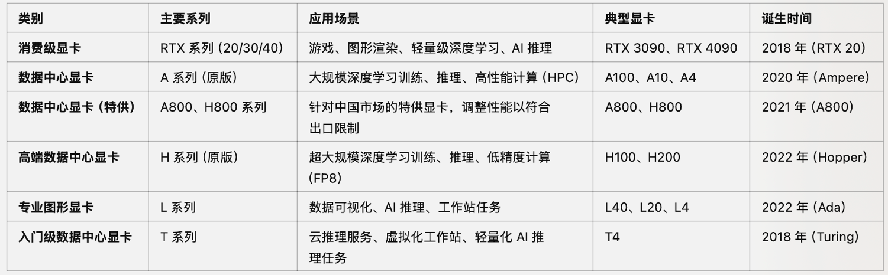

### 5.2NVIDIA 各类显卡功能总结

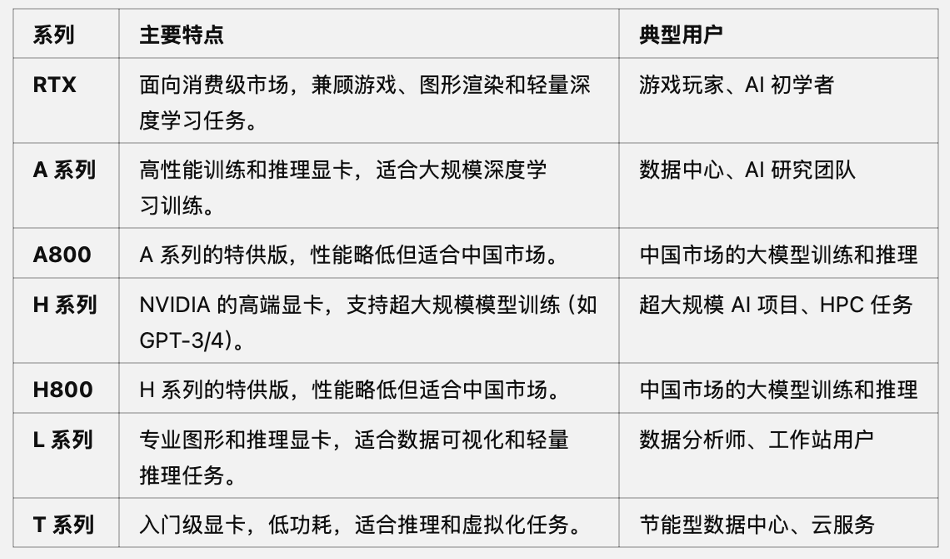

## 6.各类GPU的FP16和FP8训练和推理性能

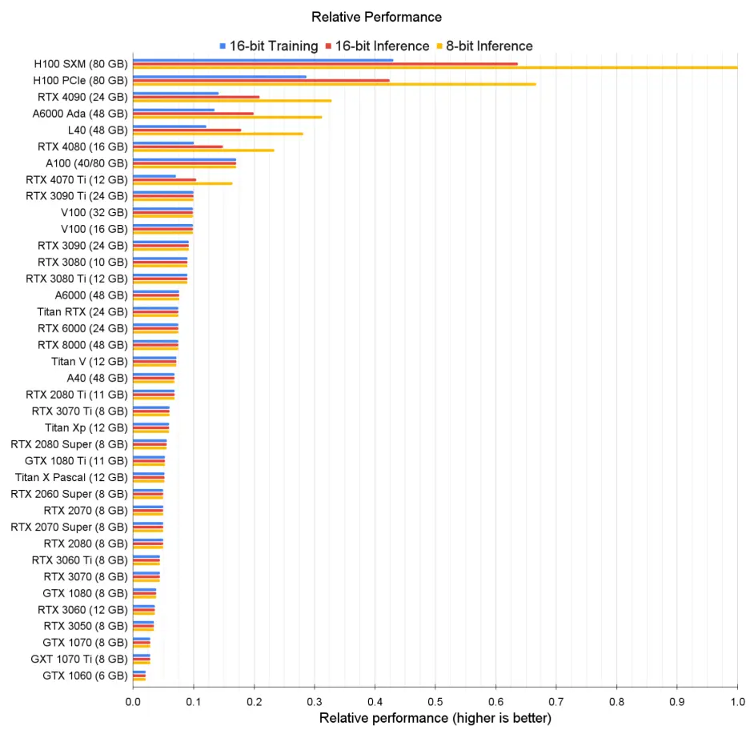

不同显卡性能对比**重要结论**

- H系列显卡性能在训练以及各精度训练⽅⾯⼤幅领先；  
-  4090推理性能很强（强于A100），但训练能⼒不如A100，且受限于显存⼤⼩和显存带宽，整体训练能⼒较弱；  
- 3090的推理和训练的理论性能越是A100的60%，但同样受限于显存⼤⼩和显存带宽，实际性能和A100差距较⼤，但仍不失为低成本模型训练；  
- A10、T4等显卡在深度学习推理与训练⽅⾯表现较差；

## 7.不同尺⼨、不同精度  ⼤模型推理所需显存占⽤

- 其中RTX 4090可等价替换为RTX 3090；  
- 其中A100可替换为A800（国内特供）； 
- 其中L40可替换为L20（国内特供）；

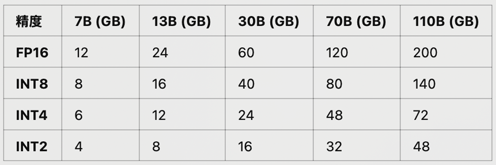

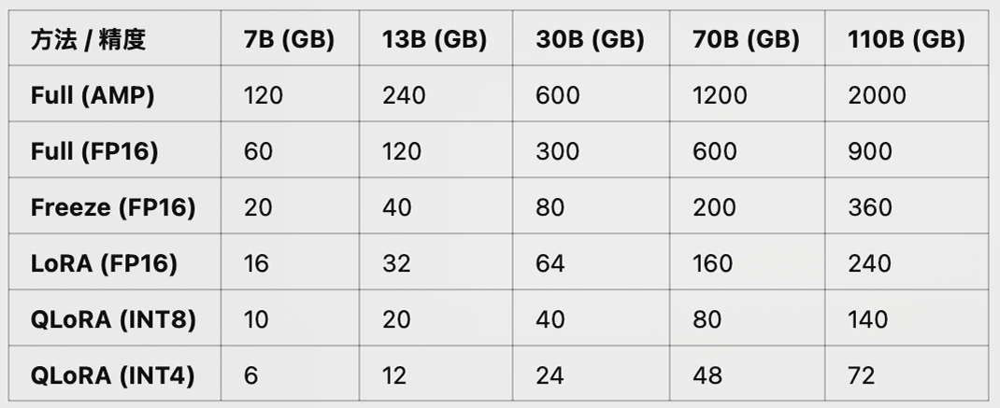

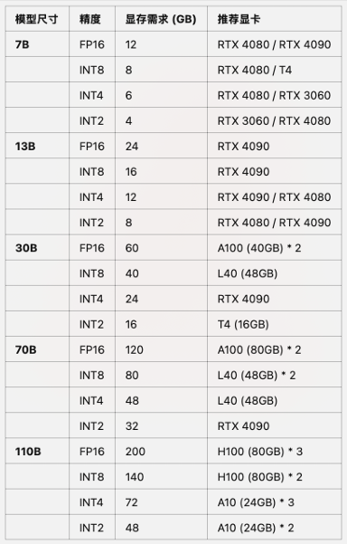

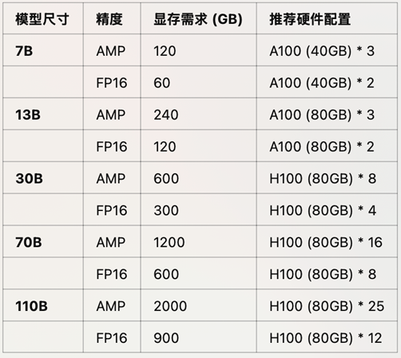

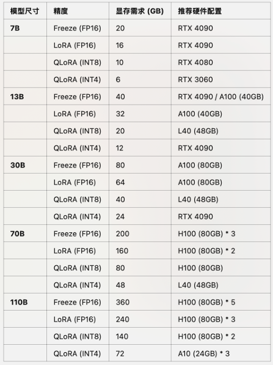

## 8.不同使⽤场景下推荐GPU配置⽅案

### 8.1个⼈学习、⼩型科研团队

单台服务器参考配置

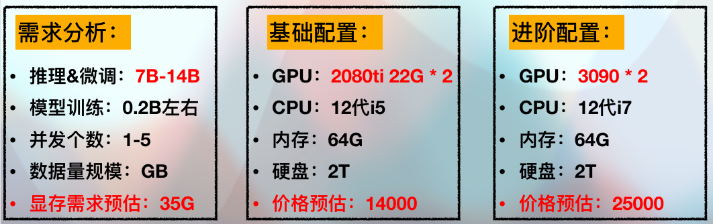

### 8.2中⼩型科研团队、初创公司

单台服务器参考配置

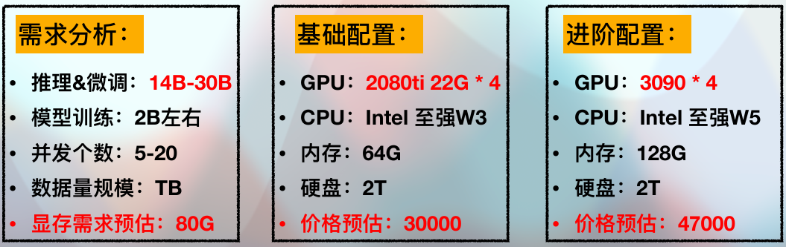

### 8.3⼤型科研团队、中⼤型公司

单台服务器参考配置

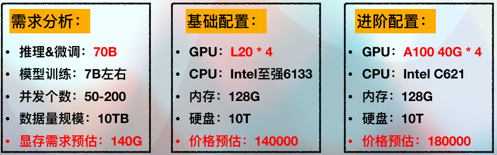

## **关于 Ampere GPU**

A10 和 A100 中的“A”表示这些 GPU 是基于 NVIDIA 的Ampere 微架构构建的。Ampere 以物理学家 André-Marie Ampère 的名字命名，是 NVIDIA 推出的一种微架构，用于替代之前的Turing 微架构。Ampere 微架构于 2020 年首次发布，为RTX 3000 系列消费级 GPU提供支持，其中最受瞩目的是 GeForce RTX 3090 Ti，但它在数据中心的影响更大。基于 Ampere 的数据中心 GPU 有六种：

NVIDIA A2，NVIDIA A10， NVIDIA A16， NVIDIA A30， NVIDIA A40， NVIDIA A100（有 40 和 80 GiB 版本）。

在这些 GPU 中，A10 和 A100 最常用于模型推理，还有 A10G，这是 A10 的 AWS 特定变体，可互换用于大多数模型推理任务。我们将在本文中比较标准 A10 和 80 GB 的 A100。

## **A10 与 A100：规格**

这两款 GPU 都有很长的规格表，但一些关键信息让我们了解 A10 和 A100 在 ML 推理方面的性能差异。

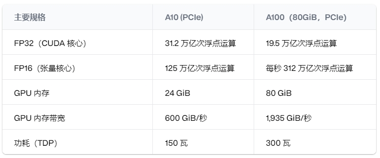

对于机器学习推理来说，最重要的因素是 FP16 Tensor Core 性能，它表明 A100 的性能是 A10 的两倍多，拥有 312 teraFLOP（1 teraFLOP 是每秒一万亿次浮点运算）。A100 还拥有三倍以上的 VRAM，这对于处理大型模型至关重要。

Llama 2是 Meta 开源的大型语言模型，有三种大小：7b、13b和 70b个参数。模型大小越大，结果越好，但需要更多的 VRAM 来运行模型。

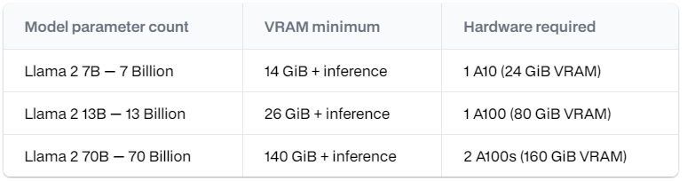

A100 GPU 可让您运行更大的模型，对于超过其 80 GB VRAM 容量的模型，您可以在单个实例中使用多个 GPU 来运行该模型。

一个好的经验法则是，大型语言模型在 fp16 中运行时，每十亿个参数需要 2 GB 的 VRAM，再加上运行推理和处理输入和输出的一些开销。因此，Llama 2 模型具有以下硬件要求：

**参考**

[NVIDIA A10 与 A100 GPU 对比分析：用于LLM 和Stable Diffusion推理](https://www.jaeaiot.com/news/detail/295.html)

[NVIDIA A10 vs A100 GPUs for LLM and Stable Diffusion inference | Baseten Blog](https://www.baseten.co/blog/nvidia-a10-vs-a100-gpus-for-llm-and-stable-diffusion-inference/)
