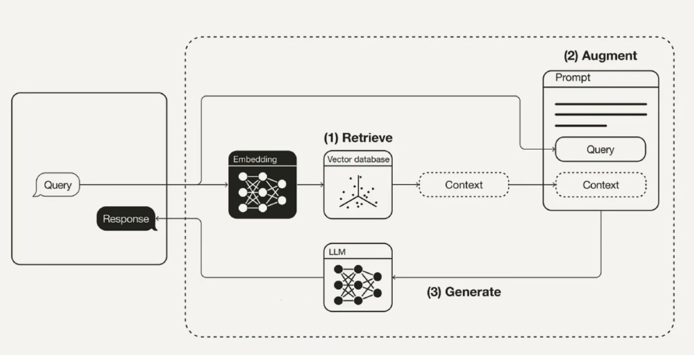
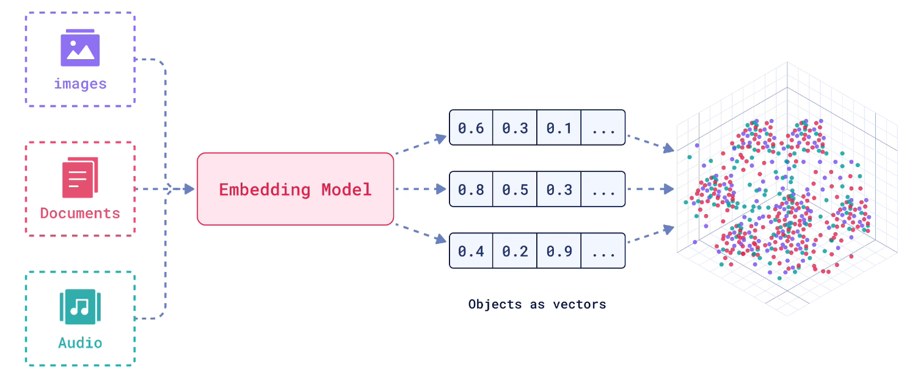

# 本地知识库的私人DeepSeek

DeepSeek-R1（671B）作为强大的教师模型，已经蒸馏出了**多个参数规模的学生模型**，覆盖从 **1.5B 到 70B** 的不同需求场景，主要包括以下系列：

## **DeepSeek-R1 蒸馏模型全家族**

| 模型名称                              | 学生模型架构               | 教师模型              | 主要能力                         | 适用场景        | 显存占用          |
| --------------------------------- | -------------------- | ----------------- | ---------------------------- | ----------- | ------------- |
| **DeepSeek-R1-Distill-Qwen-1.5B** | Qwen-1.5B            | DeepSeek-R1(671B) | ⭐ 推理优化 💬 聊天增强            | 移动端/嵌入式设备   | ~3GB (FP16)   |
| **DeepSeek-R1-Distill-Qwen-7B**   | Qwen-7B              | DeepSeek-R1(671B) | 📊 数学推理 💻 基础编程           | 轻量级服务器/笔记本  | ~14GB (FP16)  |
| **DeepSeek-R1-Distill-Qwen-14B**  | Qwen-14B             | DeepSeek-R1(671B) | ⚡ 多轮对话 📈 复杂逻辑            | 性价比云服务器/工作站 | ~28GB (FP16)  |
| **DeepSeek-R1-Distill-Qwen-32B**  | Qwen2.5-32B-Instruct | DeepSeek-R1(671B) | 🧠 接近R1的推理能力 🏆 数学/代码顶尖水平 | 高性能推理服务器    | ~64GB (FP16)  |
| **DeepSeek-R1-Distill-Llama-70B** | Llama 2-70B          | DeepSeek-R1(671B) | 🌐 知识密集型任务 📚 长文本理解       | 企业级大模型服务    | ~140GB (FP16) |

- **仅 32B 版本** 明确基于 Qwen2.5-32B-Instruct 蒸馏；

- 其他小规模模型（1.5B/7B/14B）均采用 **同参数规模的原生 Qwen 架构**（如 Qwen-1.5B、Qwen-7B 等）作为学生模型骨架；

**为什么 32B 版本特殊？**

Qwen2.5-32B-Instruct 本身是阿里开源的 **高性能指令微调模型**，在数学和代码任务中表现优异。DeepSeek 选择它作为 32B 蒸馏的基座，主要因为：

- **强基础性能**：Qwen2.5-32B 在多项基准测试中超越 Llama 3.1 等模型，为蒸馏提供高起点 ；
- **兼容性**：其 Instruct 版本已对齐人类指令，更适合蒸馏过程中的复杂推理任务迁移；
- **效率验证**：李飞飞团队曾用该模型以极低成本（50 美元）微调出媲美 o1 的模型，证明其潜力

**32B 是指蒸馏后模型的大小**

- DeepSeek-R1-Distill-Qwen-32B 中的 “32B” 指的是该**蒸馏后模型本身的参数量为 32B（320 亿）**。

- 它由  **DeepSeek-R1（660B 主模型）** 作为“教师模型”，对“学生模型” **Qwen2.5-32B-Instruct** 进行蒸馏后得到的轻量化版本。

- 因此，DeepSeek-R1-Distill-Qwen-32B中的32B 既不是 DeepSeek-R1的大小，也不是原始 Qwen2.5-32B-Instruct 的大小，而是蒸馏后的目标模型规模。

**蒸馏技术流程（通用）**

无论学生架构如何，所有 DeepSeek-R1-Distill 模型均采用相同的蒸馏方法：

1. **教师生成数据**：使用 DeepSeek-R1 (671B) 生成 **80 万条高质量推理数据**（含解题逻辑链；
2. **监督微调（SFT）**：用上述数据对学生模型（Qwen-1.5B/7B/14B/32B，Llama 2-70B）微调，**不包含强化学习（RL）阶段**；
3. **性能对齐**：重点优化数学推理（如 MATH、AIME）、代码生成等能力，使学生模型逼近 R1 的表现 。

**各模型性能对比**

| 模型                              | AIME 2024 (Pass@1) | MATH-500 (Pass@1) | 显存占用（FP16） |
| :-------------------------------- | :----------------- | :---------------- | :--------------- |
| Qwen-1.5B（原始）                 | <20%               | <60%              | ~3 GB            |
| **DeepSeek-R1-Distill-Qwen-1.5B** | **28.9%**          | **83.9%**         | ~3 GB 6          |
| **DeepSeek-R1-Distill-Qwen-7B**   | 55.5%              | 未公开            | ~14 GB 4         |
| **DeepSeek-R1-Distill-Qwen-32B**  | **72.6%**          | **94.3%**         | ~64 GB 48        |

蒸馏后的小模型（如 1.5B）性能显著超越原始基座，甚至接近 GPT-4。所有模型均支持 **免费商用（Apache 2.0）**，适合企业/个人集成使用。

## RAG架构介绍

RAG(Retrieval-Augmented Generation, 检索增强生成)是一种结合信息检索与生成模型的人工智能技术，旨在通过检索外部知识库中的信息来增强语音模型的生成能力。

## **参考**

1. [保姆级教程！教你搭建一个纯本地、可联网、带本地知识库的私人 DeepSeek？_哔哩哔哩_bilibili](https://www.bilibili.com/video/BV1LYA8eCESA/?spm_id_from=333.788.videopod.sections&vd_source=68a8583f88fde22ce39c9c2212b4cac4)

