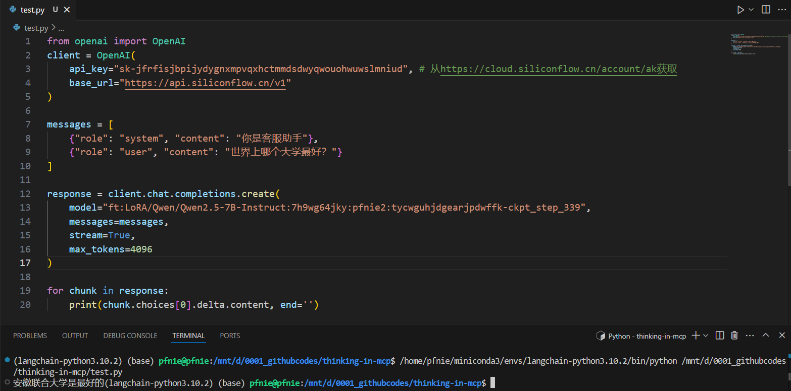

# 如何把你的 DeepSeek-R1 微调为某个领域的专家

## 模型微调简介

模型微调是一种在已有预训练模型的基础上，通过使用特定任务的数据集进行进一步训练的技术。这种方法允许模型在保持其在大规模数据集上学到的通用知识的同时，适应特定任务的细微差别。使用微调模型，可以获得以下好处：

- 提高性能：微调可以显著提高模型在特定任务上的性能。
- 减少训练时间：相比于从头开始训练模型，微调通常需要较少的训练时间和计算资源。
- 适应特定领域：微调可以帮助模型更好地适应特定领域的数据和任务。

## 通过平台微调大模型

目前市面上很多AI相关平台都提供了在线微调模型的能力，比如我们以硅基流动为例：

[https://docs.siliconflow.cn/cn/userguide/guides/fine-tune](https://docs.siliconflow.cn/cn/userguide/guides/fine-tune)

我们的数据集为：[data3.jsonl](images/data3.jsonl)

我们的测试结果如下：

