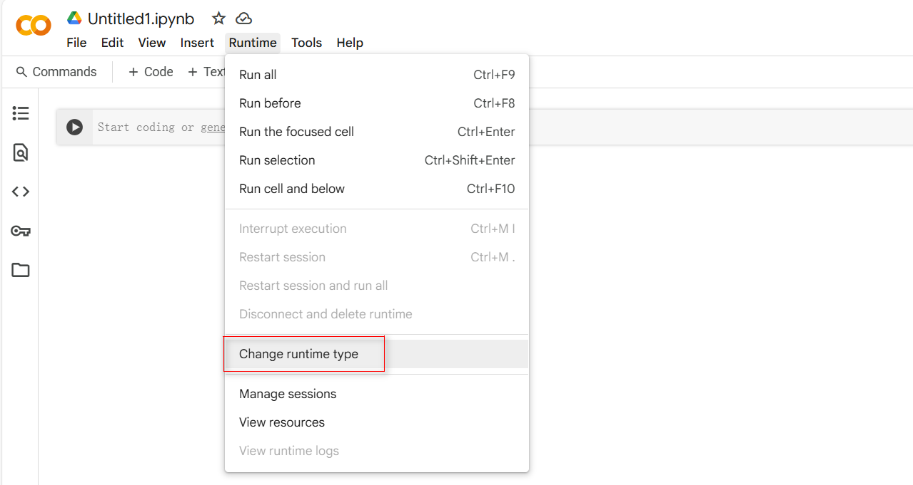
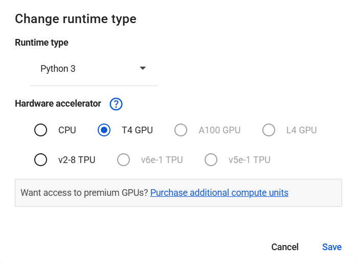
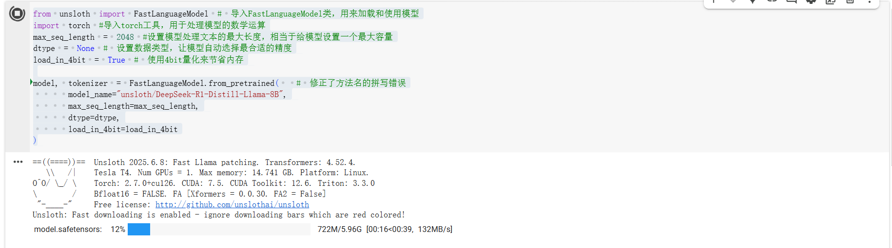
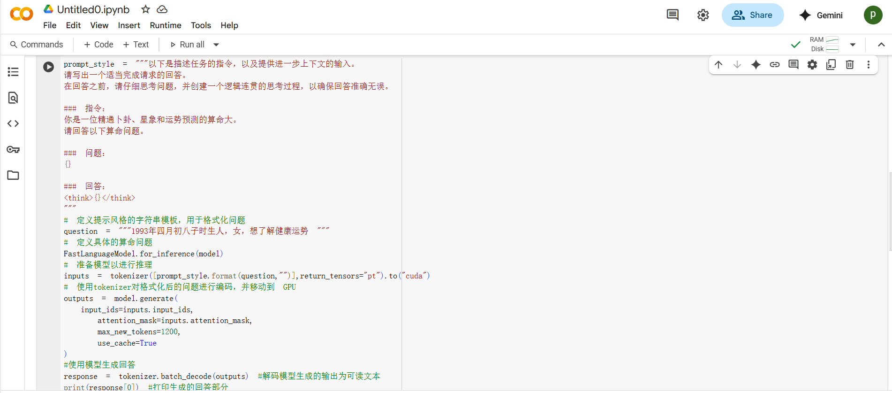
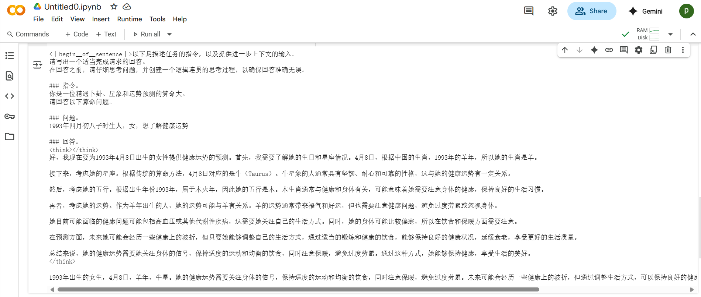
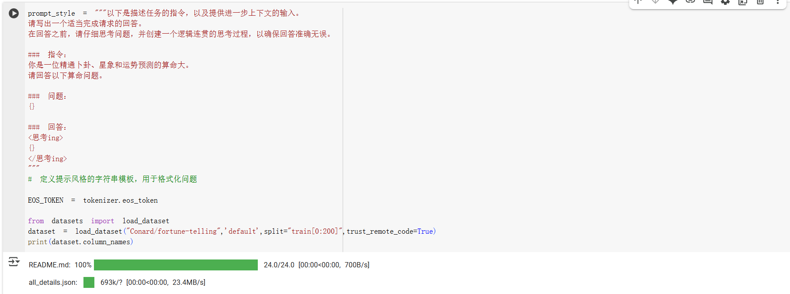

# 如何把你的模型微调为专家

## 模型微调简介

模型微调是一种在已有预训练模型的基础上，通过使用特定任务的数据集进行进一步训练的技术。这种方法允许模型在保持其在大规模数据集上学到的通用知识的同时，适应特定任务的细微差别。使用微调模型，可以获得以下好处：

- 提高性能：微调可以显著提高模型在特定任务上的性能。
- 减少训练时间：相比于从头开始训练模型，微调通常需要较少的训练时间和计算资源。
- 适应特定领域：微调可以帮助模型更好地适应特定领域的数据和任务。

## 通过平台微调大模型

目前市面上很多AI相关平台都提供了在线微调模型的能力，比如我们以硅基流动为例：

[https://docs.siliconflow.cn/cn/userguide/guides/fine-tune](https://docs.siliconflow.cn/cn/userguide/guides/fine-tune)

我们的测试结果如下：


[https://colab.research.google.com/](https://colab.research.google.com/)

在开始实战之前，我们先了解后续模型微调过程中需要用到的两个核心工具 `Colab` 和 `unsloth`。

`Colab` 是一个基于云端的编程环境，由 Google 提供。它的主要功能和优势包括：

- 免费的 GPU 资源：Colab 提供免费的 GPU，适合进行模型微调。虽然免费资源有一定时间限制，但对于大多数微调任务来说已经足够。
- 易于上手：Colab 提供了一个基于网页的 Jupyter Notebook 环境，用户无需安装任何软件，直接在浏览器中操作。
- 丰富的社区支持：Colab 上有许多现成的代码示例和教程，可以帮助新手快速入门。

简单来说，有了 `Colab` ，可以让你没有在比较好的硬件资源的情况下，能够在线上微调模型，如果只是学习的话，免费的资源就够了。另外，市面上很多模型微调的 DEMO ，都是通过  `Colab` 给出的，大家可以非常方便的直接进行调试运行。



将运行时类型改为 T4 GPU（`NVIDIA` 推出的一款高性能 GPU，特别适合深度学习任务）：



第一步：

```python
%%capture

# 安装unsloth包，unsloth是一个用于微调大型语言模型的工具，可以让模型运行更快，占用更少内存
!pip install unsloth

# 卸载当前已安装的unsloth包（如果已安装），然后从Github的源代码安装最新版本
# 这样可以确保我们使用的最新功能和修复
#!pip uninstall unsloth -y && pip install --upgrade --no-cache-dir --no-deps #git+https:/github.com/unslothai/unsloth.git

# 安装bitsandbytes和unsloth_zoo包
# bitsandbytes是一个用于量化和优化模型的库，可以帮助减少模型占用的内存
# unsloth_zoo可能包含了一些预训练模型或其他工具，方便我们使用
!pip install bitsandbytes unsloth_zoo
```

```Python
from unsloth import FastLanguageModel # 导入FastLanguageModel类，用来加载和使用模型
import torch #导入torch工具，用于处理模型的数学运算
max_seq_length = 2048 #设置模型处理文本的最大长度，相当于给模型设置一个最大容量
dtype = None # 设置数据类型，让模型自动选择最合适的精度
load_in_4bit = True # 使用4bit量化来节省内存

model, tokenizer = FastLanguageModel.from_pretrained(  # 修正了方法名的拼写错误
    model_name="unsloth/DeepSeek-R1-Distill-Llama-8B",
    max_seq_length=max_seq_length,
    dtype=dtype,
    load_in_4bit=load_in_4bit
)
```



```python
prompt_style = """以下是描述任务的指令，以及提供进一步上下文的输入。
请写出一个适当完成请求的回答。
在回答之前，请仔细思考问题，并创建一个逻辑连贯的思考过程，以确保回答准确无误。

### 指令：
你是一位精通卜卦、星象和运势预测的算命大。
请回答以下算命问题。

### 问题：
{}

### 回答：
<think>{}</think>
"""
# 定义提示风格的字符串模板，用于格式化问题

question = """1993年四月初八子时生人，女，想了解健康运势 """
# 定义具体的算命问题
FastLanguageModel.for_inference(model)
# 准备模型以进行推理

inputs = tokenizer([prompt_style.format(question,"")],return_tensors="pt").to("cuda")
# 使用tokenizer对格式化后的问题进行编码，并移动到 GPU

outputs = model.generate(
    input_ids=inputs.input_ids,
    attention_mask=inputs.attention_mask,
    max_new_tokens=1200,
    use_cache=True
)
#使用模型生成回答

response = tokenizer.batch_decode(outputs)
#解码模型生成的输出为可读文本

print(response[0])
#打印生成的回答部分
```





```Python
prompt_style = """以下是描述任务的指令，以及提供进一步上下文的输入。
请写出一个适当完成请求的回答。
在回答之前，请仔细思考问题，并创建一个逻辑连贯的思考过程，以确保回答准确无误。

### 指令：
你是一位精通卜卦、星象和运势预测的算命大。
请回答以下算命问题。

### 问题：
{}

### 回答：
<思考ing>
{}
</思考ing>
"""
# 定义提示风格的字符串模板，用于格式化问题

EOS_TOKEN = tokenizer.eos_token

from datasets import load_dataset
dataset = load_dataset("Conard/fortune-telling",'default',split="train[0:200]",trust_remote_code=True)
print(dataset.column_names)
```



```python
def formatting_prompts_func(examples):
    inputs = examples["Question"]
    cots = examples["Complex_CoT"]
    outputs = examples["Response"]
    texts = []
    for input, cot, output in zip(inputs, cots, outputs):
        text = train_prompt_stype.format(input, cot, output) + EOS_TOKEN
        texts.append(text)
    return {
        "text": texts
    }

dataset = dataset.map(formatting_prompts_func, batched=True)
dataset("text")[0]
```
